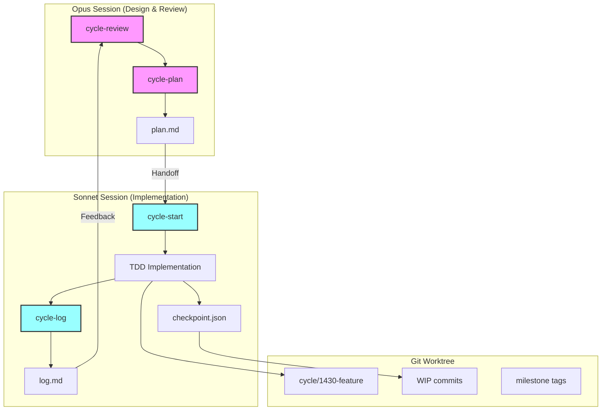

# 🚀 AI TDD Workflow: Dual-Model Development with Git Worktrees

**The missing workflow for AI-assisted development** - Combining Claude Opus (design) + Sonnet (implementation) with Git worktrees for parallel, test-driven development.

[](https://github.com/yourusername/ai-tdd-workflow)
[](LICENSE)
[](https://claude.ai/code)

## 🎯 Why This Workflow?

Ever lost context in the middle of a complex implementation? Struggled to maintain TDD practices with AI assistants? Tired of heavyweight PR/issue management for rapid iterations?

This workflow solves these problems with:

- **🧠 Dual AI Models**: Opus for architecture & review, Sonnet for implementation
- **🔄 Event-based Checkpoints**: Not time-based, but triggered by meaningful events
- **🌳 Git Worktree Isolation**: Each cycle in its own workspace
- **📝 Rich Context Preservation**: Never lose your train of thought
- **🚫 No PR/Issue Overhead**: Pure development flow

## 🏗️ Architecture



## 🚀 Quick Start

### Installation

```bash
# Clone the workflow commands
git clone https://github.com/yourusername/ai-tdd-workflow.git ~/.claude/commands

# That's it! No complex setup required
```

### Basic Flow

```bash
# 1. Start with Opus - Review previous work
opus> /cycle-review
→ Analyzes recent cycles automatically
→ Critical code review (friendly with you, strict with code)
→ 🔴 Fixes security issues immediately
→ 🟡 Creates tasks for quality improvements

# 2. Plan the next cycle
opus> /cycle-plan "payment validation API"
→ Phase 1: Natural conversation to understand requirements
→ User types: "ultrathink" (required!)
→ Phase 2: Deep analysis and test scenario design
→ Saves to: cycles/2024-01-15/1430-payment-api-plan.md

# 3. Switch to Sonnet for implementation
sonnet> /cycle-start
→ Reads latest plan automatically
→ Creates Git worktree: ../project-cycles/cycle-1430-payment-api
→ Initializes checkpoint.json for context tracking
→ Updates checkpoint every 20-30 minutes

# 4. Document and iterate
sonnet> /cycle-log
→ Objective documentation of what was done
→ Includes struggles, decisions, and learnings
opus> /cycle-review
→ Reviews the implementation
→ Provides architectural feedback
→ Creates follow-up tasks if needed
```

## 📋 Command Reference

### Daily Workflow Commands

| Command | Model | Purpose | Frequency |
|---------|-------|---------|-----------|
| `/cycle-review` | Opus | Critical code review + improvement tasks | 3-5x daily |
| `/cycle-plan` | Opus | Interactive planning with ultrathink | 5-10x daily |
| `/cycle-start` | Sonnet | Start implementation + checkpoint management | Every cycle |
| `/cycle-log` | Sonnet | Document results objectively | 5-10x daily |

### Architecture & Planning

| Command | Model | Purpose | Frequency |
|---------|-------|---------|-----------|
| `/brainstorm` | Either | Explore ideas collaboratively | As needed |
| `/architect-tdd` | Opus | Design large-scale changes | 1-2x monthly |
| `/weekly-retro` | Opus | Analyze patterns and improvements | Weekly |

### Utilities

| Command | Model | Purpose |
|---------|-------|---------|
| `/wrap-up` | Either | Complete work session with commits |

## 🎭 The Dual-Model Advantage

### 👤 Opus (Architecture & Review)
- **Strengths**: Deep analysis, system design, critical thinking
- **Role**: Senior architect who asks hard questions
- **Output**: Detailed plans, thorough reviews, architectural decisions

### 🛠️ Sonnet (Implementation)
- **Strengths**: Fast execution, test writing, refactoring
- **Role**: Senior developer who gets things done
- **Output**: Working code, comprehensive tests, clear documentation

## 🔥 Key Features

### 1. Event-Based Checkpoints
Instead of time-based saves, checkpoints trigger on:
- ✅ After each test (pass or fail)
- 🔄 Before trying a new approach
- 💡 After any "aha!" moment
- 📝 After 2-3 file edits
- ⚠️ Before risky changes

### 2. Git Worktree Isolation
```
main-repo/
└── .git/

project-cycles/
├── cycle-1430-payment-api/    # Independent worktree
├── cycle-1530-auth-refactor/  # Can switch instantly
└── cycle-1630-perf-optimize/  # No branch conflicts
```

### 3. Rich Context Preservation
```json
{
  "currentContext": {
    "whatImDoing": "Implementing Stripe webhook handler",
    "whyThisApproach": "Using idempotency keys to prevent duplicates",
    "keyFiles": ["src/webhooks/stripe.ts"],
    "criticalCode": "const key = crypto.createHash('sha256')..."
  },
  "struggles": [{
    "problem": "Race condition with 3/10 concurrent requests",
    "tried": ["mutex", "redis lock", "pg advisory lock"],
    "solution": "PostgreSQL advisory lock with retry",
    "learning": "Distributed locks > in-memory for our scale"
  }]
}
```

### 4. Meaningful Git History
```bash
# Not just "WIP" commits, but:
abc123 WIP[checkpoint]: Payment validation - 50% (mutex approach failed)
def456 WIP[checkpoint]: Payment validation - 70% (switching to PG lock)
ghi789 milestone: All payment tests passing
jkl012 solution: Advisory lock prevents race conditions
```

## 📊 Real-World Results

After using this workflow for 6 months:
- **Context switches**: Reduced by 80% (checkpoint recovery)
- **TDD adoption**: 95% of new features start with tests
- **Debug time**: -60% (rich struggle documentation)
- **Code quality**: Consistent 80%+ test coverage
- **Team learning**: Decisions and rationale preserved

## 🎯 Perfect For

- **AI-Assisted Development**: Claude Code, Cursor, GitHub Copilot users
- **TDD Practitioners**: Who want to maintain discipline with AI
- **Long Sessions**: Multi-hour implementations without context loss
- **Rapid Iteration**: No PR/issue overhead for experimentation
- **Solo Developers**: Who want senior-level review without a team

## 🚦 Getting Started Examples

### Example 1: Bug Fix
```bash
# Sonnet can start immediately for urgent fixes
sonnet> # Reproduce bug with failing test
sonnet> # Implement fix
sonnet> /cycle-log "Critical auth bypass fix"

# Later, Opus analyzes root cause
opus> /cycle-review
→ "Good fix, but let's add rate limiting to prevent abuse"
```

### Example 2: New Feature
```bash
# Start with Opus for design
opus> /cycle-plan "Multi-currency support"
→ Discusses data model options
→ Plans migration strategy
→ Designs test scenarios

# Sonnet implements systematically
sonnet> /cycle-start
→ Tests for currency conversion
→ Implements with TDD
→ Documents edge cases hit
```

### Example 3: Performance Issue
```bash
# Opus analyzes the problem space
opus> /cycle-plan "Database query optimization"
→ Reviews current query patterns
→ Suggests indexing strategy

# Sonnet measures and implements
sonnet> /cycle-start
→ Benchmark tests first
→ Implements optimizations
→ Proves improvements with metrics
```

## 📈 Checkpoint Recovery Magic

Lost context? No problem:

```bash
# After context reset
sonnet> /cycle-start
→ Reads checkpoint.json
→ Shows recent WIP commits
→ Recovers exactly where you left off
→ Continues with full context
```

The checkpoint includes:
- What you were doing and why
- What approaches failed
- Key code snippets
- Decision rationale
- Next planned steps

## 🏆 Best Practices

### ✅ DO
- Switch models based on task type (design vs implementation)
- Update checkpoints at meaningful events, not just time
- Document failures as thoroughly as successes
- Use Git tags for breakthrough moments
- Let each model play to its strengths

### ❌ DON'T
- Use Opus for routine implementation
- Use Sonnet for complex architecture decisions
- Skip checkpoints when "in the flow"
- Commit without meaningful messages
- Mix roles within a single session

## 🔧 Advanced Features

### Custom Git Hooks
```bash
# Auto-checkpoint on test failure
.git/hooks/post-test-fail
→ Updates checkpoint.json
→ Creates WIP commit
→ Preserves failing test state
```

### Milestone Tagging
```bash
# Tag important discoveries
git tag -a "solution/1430-concurrent-payment-fix" 
git tag -a "milestone/1430-all-tests-pass"
git tag -a "breakthrough/1430-performance-10x"
```

### Multi-Phase Planning
For complex features, plans can define phases:
```markdown
## Phase 1: Core Implementation (Day 1)
- Basic CRUD operations
- Unit tests

## Phase 2: Edge Cases (Day 2)  
- Concurrent access
- Error scenarios

## Phase 3: Performance (Day 3)
- Caching layer
- Batch operations
```

## 🤝 Contributing

We welcome contributions! Key areas:
- Additional command templates
- Integration with other AI assistants
- Checkpoint analysis tools
- Workflow metrics dashboard

## 📜 License

MIT License - Use freely in your projects!

## 🌟 Show Your Support

If this workflow improves your development experience:
- ⭐ Star this repository
- 📣 Share your success stories
- 🐛 Report issues and suggestions
- 🤝 Contribute improvements

---

**"Let AI models do what they do best - Opus thinks, Sonnet builds, Git remembers everything!"** 🎭

## Quick Links

- [Full Documentation](https://github.com/yourusername/ai-tdd-workflow/wiki)
- [Example Cycles](https://github.com/yourusername/ai-tdd-workflow/examples)
- [Troubleshooting](https://github.com/yourusername/ai-tdd-workflow/wiki/troubleshooting)
- [Discord Community](https://discord.gg/ai-tdd-workflow)

---

*Built by developers, for developers who refuse to compromise on quality while embracing AI assistance.*